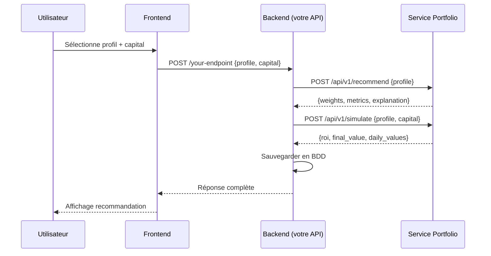

# Portfolio Management Service — Documentation Technique

## Table des matières

1. [Vue d'ensemble](#vue-densemble)
2. [Architecture et composants](#architecture-et-composants)
3. [Installation et configuration](#installation-et-configuration)
4. [Lancement des services](#lancement-des-services)
5. [API REST — Endpoint principal](#api-rest--endpoint-principal)
6. [Intégration backend](#intégration-backend)
7. [Flux de données](#flux-de-données)

---

## Vue d'ensemble

Ce microservice implémente un **conseiller en portefeuille automatisé** utilisant:
- **Reinforcement Learning (PPO — Proximal Policy Optimization)** pour l'optimisation de portefeuille
- **Données macroéconomiques réelles** (Banque Mondiale, FMI, BCT)
- **Explainability (SHAP + LLM)** pour générer des explications en français
- **Profils de risque** (conservateur, modéré, agressif) avec ajustement automatique des poids
- **Simulation historique** pour calculer ROI, Sharpe, Sortino, Max Drawdown

### Technologies

- **Python 3.12** avec `uv` pour la gestion de l'environnement
- **FastAPI** (API REST)
- **Streamlit** (UI de démonstration)
- **Stable-Baselines3** (agent PPO)
- **SHAP** (explainability)
- **OpenRouter** (LLM pour explications en français)
- **yfinance** (données BVMT)
- **httpx** (appels API World Bank, IMF, BCT)

### Actifs tunisiens gérés

`BIAT`, `BH`, `ATB`, `STB`, `SFBT`, `UIB`, `BNA`, `ATTIJARI`

---

## Architecture et composants

```
portfolio_management_service/
├── main.py                     # Point d'entrée FastAPI
├── streamlit_app.py            # Interface utilisateur de démonstration
├── requirements.txt            # Dépendances Python
├── .env.example                # Template de configuration
├── .env                        # Configuration (à créer)
│
├── app/
│   ├── api/
│   │   ├── endpoints.py        # Handlers des 7 endpoints REST
│   │   ├── routes.py           # Configuration des routes
│   │   └── schemas.py          # Modèles Pydantic (Request/Response)
│   │
│   ├── core/
│   │   ├── config.py           # Settings centralisés (tout paramétrable)
│   │   └── types.py            # Enums (RiskProfile, Signal, StressType)
│   │
│   ├── data/
│   │   ├── stock_loader.py     # Chargement des cours BVMT via yfinance
│   │   ├── features.py         # Feature engineering (RSI, SMA, MACD, volatilité)
│   │   ├── macro.py            # Agrégation des données macro (WB + IMF + BCT)
│   │   ├── preprocessor.py     # Normalisation et préparation
│   │   └── providers/
│   │       ├── world_bank.py   # API Banque Mondiale (7 indicateurs)
│   │       ├── imf.py          # API FMI DataMapper (5 indicateurs)
│   │       └── bct.py          # Scraping BCT (taux directeur, TMM, taux d'épargne)
│   │
│   ├── portfolio/
│   │   ├── tracker.py          # État du portefeuille (cash, positions, transactions)
│   │   ├── metrics.py          # Calcul Sharpe, Sortino, Max Drawdown, volatilité
│   │   ├── profile.py          # Ajustement des poids selon le profil de risque
│   │   └── simulator.py        # Simulation historique avec capital utilisateur
│   │
│   ├── rl/
│   │   ├── environment.py      # Environnement Gymnasium (PortfolioEnv)
│   │   ├── rewards.py          # Fonction de récompense (Sharpe ajusté)
│   │   └── agents/
│   │       ├── optimizer.py    # Agent PPO (Stable-Baselines3)
│   │       ├── adversary.py    # Agent adversaire pour entraînement robuste
│   │       └── trainer.py      # Pipelines d'entraînement (quick_train, adversarial_train)
│   │
│   └── explainability/
│       ├── shap_explain.py     # SHAP KernelExplainer (importance des features)
│       └── interpreter.py      # Génération d'explication via LLM (OpenRouter)
│
├── tests/                      # 49 tests unitaires (pytest)
└── models/                     # Modèles RL sauvegardés (généré automatiquement)
```

### Principes de conception

- **Modularité** : chaque fichier ≤ 100 lignes
- **Configuration centralisée** : tous les paramètres dans `app/core/config.py` et `.env`
- **Pas de valeurs hardcodées** : tout est paramétrable
- **Type safety** : Pydantic pour validation des entrées/sorties
- **Tests complets** : 49 tests couvrant tous les modules

---

## Installation et configuration

### Prérequis

- **Python 3.12+** (installé via `pyenv` recommandé)
- **uv** (gestionnaire d'environnement et de paquets ultra-rapide)

### Étape 1 : Créer l'environnement virtuel

```bash
cd /chemin/vers/portfolio_management_service

# Créer l'environnement avec uv
uv venv .venv
```

### Étape 2 : Installer les dépendances

```bash
# Activer l'environnement
source .venv/bin/activate  # Linux/macOS
# ou .venv\Scripts\activate  # Windows

# Installer toutes les dépendances
uv pip install -r requirements.txt
```

**Dépendances principales** (voir `requirements.txt`) :
- `fastapi`, `uvicorn` — API REST
- `streamlit` — Interface UI
- `stable-baselines3[extra]` — Agent PPO
- `gymnasium` — Environnement RL
- `shap` — Explainability
- `yfinance` — Données boursières
- `httpx` — Requêtes HTTP async
- `pandas`, `numpy` — Data manipulation
- `scikit-learn` — Normalisation
- `openpyxl` — Parsing Excel BCT
- `python-dotenv` — Variables d'environnement

### Étape 3 : Configurer les variables d'environnement

Copier le template et éditer le fichier `.env` :

```bash
cp .env.example .env
nano .env  # ou vim, code, etc.
```

**Contenu du `.env.example` :**

```env
# ── API Configuration ──────────────────────────────────────
API_HOST=0.0.0.0
API_PORT=8000

# ── Portfolio Settings ─────────────────────────────────────
INITIAL_CAPITAL=100000.0
TRANSACTION_COST=0.001
RISK_FREE_RATE=0.07

# ── Tunisian Bank Tickers (BVMT) ───────────────────────────
TUNISIAN_TICKERS=BIAT.TN,BH.TN,ATB.TN,STB.TN,SFBT.TN,UIB.TN,BNA.TN,ATTIJARI.TN

# ── RL Hyperparameters ─────────────────────────────────────
RL_LEARNING_RATE=0.0003
RL_GAMMA=0.99
RL_GAE_LAMBDA=0.95
RL_CLIP_RANGE=0.2

# ── Storage ────────────────────────────────────────────────
MODEL_DIR=models
DATA_DIR=data

# ── OpenRouter LLM (for explainability) ────────────────────
OPENROUTER_API_KEY=sk-or-v1-YOUR_KEY_HERE
OPENROUTER_BASE_URL=https://openrouter.ai/api/v1
LLM_MODEL=google/gemma-3-4b-it:free
LLM_MAX_TOKENS=500

# ── BCT Fixed Rates (Tunisian Central Bank) ────────────────
BCT_POLICY_RATE=8.0
BCT_TMM=7.08
BCT_SAVINGS_RATE=6.0
```

**⚠️ IMPORTANT :** 
- Remplacer `OPENROUTER_API_KEY` par votre clé (gratuite sur https://openrouter.ai)
- Les autres valeurs sont déjà configurées et fonctionnelles

---

## Lancement des services

### Option 1 : Lancement manuel (développement)

#### Terminal 1 — FastAPI (backend)

```bash
cd /chemin/vers/portfolio_management_service
source .venv/bin/activate

# Lancer l'API sur le port 8000
python -m uvicorn main:app --host 0.0.0.0 --port 8000
```

L'API sera accessible sur `http://localhost:8000`  
Documentation interactive : `http://localhost:8000/docs`

#### Terminal 2 — Streamlit (interface UI)

```bash
cd /chemin/vers/portfolio_management_service
source .venv/bin/activate

# Lancer l'interface utilisateur sur le port 8501
streamlit run streamlit_app.py --server.port 8501 --server.headless true
```

L'interface sera accessible sur `http://localhost:8501`

### Option 2 : Lancement en arrière-plan (production)

```bash
# FastAPI
nohup python -m uvicorn main:app --host 0.0.0.0 --port 8000 > /tmp/fastapi.log 2>&1 &

# Streamlit
nohup streamlit run streamlit_app.py --server.port 8501 --server.headless true > /tmp/streamlit.log 2>&1 &
```

### Vérification

```bash
# Tester l'API
curl http://localhost:8000/api/v1/health
# Réponse attendue: {"status":"ok","version":"0.1.0"}

# Tester Streamlit
curl -I http://localhost:8501
# Réponse attendue: HTTP/1.1 200 OK
```

---

## API REST — Endpoint principal

### 🔑 Endpoint clé pour l'intégration backend

**POST** `/api/v1/recommend`

Cet endpoint prend en entrée le **profil de risque** de l'utilisateur et retourne une recommandation complète incluant :
- Poids d'allocation par actif
- Métriques de performance
- Explication en français générée par IA

### 📥 Format de la requête

```http
POST http://localhost:8000/api/v1/recommend
Content-Type: application/json

{
  "profile": "modere"
}
```

**Champ `profile`** (obligatoire) :
- `"conservateur"` — Profil prudent (préservation du capital)
- `"modere"` — Profil équilibré (compromis rendement/risque)
- `"agressif"` — Profil dynamique (recherche de performance maximale)

### 📤 Format de la réponse

```json
{
  "profile": "modere",
  "weights": {
    "BIAT": 0.185,
    "BH": 0.142,
    "ATB": 0.098,
    "STB": 0.173,
    "SFBT": 0.067,
    "UIB": 0.145,
    "BNA": 0.089,
    "ATTIJARI": 0.101
  },
  "metrics": {
    "sharpe": 0.847,
    "sortino": 1.123,
    "max_drawdown": -12.34,
    "total_return": 0.0456,
    "annual_volatility": 0.1823
  },
  "explanation": "Pour votre profil modéré, nous recommandons une allocation équilibrée privilégiant les grandes capitalisations bancaires tunisiennes (BIAT 18.5%, STB 17.3%, UIB 14.5%). L'allocation respecte une concentration modérée avec un maximum de 25% par actif. Le contexte macroéconomique tunisien (inflation 7.21%, taux directeur BCT 8.0%) favorise les valeurs défensives. Le ratio de Sharpe de 0.847 indique un bon équilibre rendement/risque."
}
```

### 📊 Compléter avec une simulation (optionnel mais recommandé)

Pour obtenir une projection avec le **capital réel** de l'utilisateur :

**POST** `/api/v1/simulate`

```http
POST http://localhost:8000/api/v1/simulate
Content-Type: application/json

{
  "profile": "modere",
  "capital": 5000.0,
  "days": null
}
```

**Champs de la requête :**
- `profile` : `"conservateur"` | `"modere"` | `"agressif"`
- `capital` : Montant en TND que l'utilisateur souhaite investir (optionnel, défaut: 100 000 TND)
- `days` : Nombre de jours de simulation (optionnel, défaut: toutes les données historiques disponibles)

**Réponse :**

```json
{
  "profile": "modere",
  "initial_capital": 5000.0,
  "final_value": 5748.32,
  "roi": 14.97,
  "sharpe": 0.821,
  "sortino": 1.098,
  "max_drawdown": -8.45,
  "volatility": 18.23,
  "n_days": 252,
  "daily_values": [5000.0, 5012.3, 5018.7, ..., 5748.32]
}
```

**Champs de la réponse :**
- `initial_capital` : Capital de départ (TND)
- `final_value` : Valeur finale du portefeuille (TND)
- `roi` : Rendement en pourcentage
- `sharpe` : Ratio de Sharpe (rendement ajusté au risque)
- `sortino` : Ratio de Sortino (focus sur le risque baissier)
- `max_drawdown` : Perte maximale en pourcentage depuis le pic
- `volatility` : Volatilité annualisée en pourcentage
- `n_days` : Nombre de jours simulés
- `daily_values` : Évolution quotidienne du capital (array pour courbe d'équité)

---

## Intégration backend

### Scénario typique : Interface utilisateur → API → Base de données



### Exemple d'intégration en Python

```python
import httpx

PORTFOLIO_API = "http://localhost:8000/api/v1"

async def get_portfolio_recommendation(user_profile: str, capital: float):
    """
    Obtenir une recommandation de portefeuille personnalisée.
    
    Args:
        user_profile: "conservateur" | "modere" | "agressif"
        capital: Montant en TND à investir
        
    Returns:
        dict avec weights, metrics, explanation, simulation
    """
    async with httpx.AsyncClient(timeout=120) as client:
        # 1. Obtenir la recommandation
        rec_response = await client.post(
            f"{PORTFOLIO_API}/recommend",
            json={"profile": user_profile}
        )
        rec_response.raise_for_status()
        recommendation = rec_response.json()
        
        # 2. Simuler avec le capital utilisateur
        sim_response = await client.post(
            f"{PORTFOLIO_API}/simulate",
            json={"profile": user_profile, "capital": capital}
        )
        sim_response.raise_for_status()
        simulation = sim_response.json()
        
        # 3. Combiner les résultats
        return {
            "profile": recommendation["profile"],
            "allocation": recommendation["weights"],
            "metrics": recommendation["metrics"],
            "explanation": recommendation["explanation"],
            "simulation": {
                "initial_capital": simulation["initial_capital"],
                "final_value": simulation["final_value"],
                "roi": simulation["roi"],
                "sharpe": simulation["sharpe"],
                "max_drawdown": simulation["max_drawdown"],
                "equity_curve": simulation["daily_values"]
            }
        }

# Utilisation
result = await get_portfolio_recommendation("modere", 5000.0)
print(f"ROI projeté: {result['simulation']['roi']:.2f}%")
print(f"Explication: {result['explanation']}")
```

### Exemple en Node.js / TypeScript

```typescript
interface PortfolioRecommendation {
  profile: string;
  allocation: Record<string, number>;
  metrics: {
    sharpe: number;
    sortino: number;
    max_drawdown: number;
    total_return: number;
  };
  explanation: string;
  simulation: {
    initial_capital: number;
    final_value: number;
    roi: number;
    sharpe: number;
    max_drawdown: number;
    equity_curve: number[];
  };
}

async function getPortfolioRecommendation(
  userProfile: 'conservateur' | 'modere' | 'agressif',
  capital: number
): Promise<PortfolioRecommendation> {
  const PORTFOLIO_API = 'http://localhost:8000/api/v1';

  // 1. Recommandation
  const recResponse = await fetch(`${PORTFOLIO_API}/recommend`, {
    method: 'POST',
    headers: { 'Content-Type': 'application/json' },
    body: JSON.stringify({ profile: userProfile }),
  });
  const recommendation = await recResponse.json();

  // 2. Simulation
  const simResponse = await fetch(`${PORTFOLIO_API}/simulate`, {
    method: 'POST',
    headers: { 'Content-Type': 'application/json' },
    body: JSON.stringify({ profile: userProfile, capital }),
  });
  const simulation = await simResponse.json();

  return {
    profile: recommendation.profile,
    allocation: recommendation.weights,
    metrics: recommendation.metrics,
    explanation: recommendation.explanation,
    simulation: {
      initial_capital: simulation.initial_capital,
      final_value: simulation.final_value,
      roi: simulation.roi,
      sharpe: simulation.sharpe,
      max_drawdown: simulation.max_drawdown,
      equity_curve: simulation.daily_values,
    },
  };
}

// Utilisation
const result = await getPortfolioRecommendation('modere', 5000);
console.log(`ROI projeté: ${result.simulation.roi.toFixed(2)}%`);
```

---

## Flux de données

### Pipeline complet (de la requête à la réponse)

```
1. REQUEST
   ↓
   User sends: {"profile": "modere", "capital": 5000}

2. DATA COLLECTION
   ↓
   ├─ World Bank API    → 7 macro indicators (GDP, inflation, unemployment, etc.)
   ├─ IMF DataMapper    → 5 indicators (current account, reserves, debt)
   └─ BCT Scraping      → Policy rate, TMM, exchange rates

3. STOCK DATA
   ↓
   yfinance → Historical prices for 8 Tunisian bank stocks (BIAT, BH, ATB, STB, SFBT, UIB, BNA, ATTIJARI)

4. FEATURE ENGINEERING
   ↓
   ├─ Returns (daily)
   ├─ Volatility (rolling 20 days)
   ├─ RSI (Relative Strength Index)
   ├─ SMA (Simple Moving Average)
   └─ MACD (Moving Average Convergence Divergence)

5. RL AGENT (PPO)
   ↓
   ├─ Environment: PortfolioEnv (Gymnasium)
   ├─ Observation: [prices, features, macro indicators]
   ├─ Action: Portfolio weights (one per asset)
   └─ Reward: Sharpe ratio - drawdown penalty - stress penalty

6. PROFILE ADJUSTMENT
   ↓
   ├─ Conservateur: max 15%/asset, vol cap 20%, min 10% cash
   ├─ Modéré:       max 25%/asset, vol cap 35%, min 5% cash
   └─ Agressif:     max 50%/asset, no vol cap, no min cash

7. METRICS CALCULATION
   ↓
   ├─ Sharpe Ratio
   ├─ Sortino Ratio
   ├─ Max Drawdown
   ├─ Total Return
   └─ Annual Volatility

8. EXPLAINABILITY
   ↓
   ├─ SHAP: Feature importance (which indicators drove the decision?)
   └─ LLM (OpenRouter): Generate French explanation adapted to user profile

9. SIMULATION
   ↓
   Apply recommended weights to historical prices with user's capital
   → Calculate daily equity curve, ROI, Sharpe, Sortino, Max Drawdown

10. RESPONSE
    ↓
    {
      "profile": "modere",
      "weights": {...},
      "metrics": {...},
      "explanation": "...",
      "simulation": {...}
    }
```

### Sources de données

| Source | Type | Indicateurs |
|--------|------|-------------|
| **Banque Mondiale** | API REST publique | PIB, inflation, chômage, taux de change, réserves, compte courant, dette publique |
| **FMI DataMapper** | API REST publique | Croissance PIB, dette publique/PIB, balance courante/PIB |
| **BCT** | Web scraping (XLS) | Taux directeur, TMM, taux d'épargne, taux EUR/TND, USD/TND |
| **BVMT (yfinance)** | API Python | Cours historiques des 8 banques tunisiennes cotées |

---

## Endpoints complets disponibles

| Méthode | Endpoint | Description |
|---------|----------|-------------|
| `GET` | `/api/v1/health` | Health check (status + version) |
| `GET` | `/api/v1/macro` | Données macroéconomiques agrégées |
| `GET` | `/api/v1/portfolio` | État actuel du portefeuille |
| `POST` | `/api/v1/train` | Entraîner l'agent RL (optionnel en production) |
| `POST` | `/api/v1/recommend` | **Recommandation principale** (profil → allocation + explication) |
| `POST` | `/api/v1/simulate` | **Simulation avec capital utilisateur** (profil + capital → ROI + courbe) |
| `POST` | `/api/v1/stress-test` | Test de stress (scenario + intensité → impact) |

---

## Tests

```bash
# Activer l'environnement
source .venv/bin/activate

# Lancer tous les tests (49 tests)
pytest tests/ -v

# Avec couverture
pytest tests/ --cov=app --cov-report=html
```

**Structure des tests :**
- `test_api.py` — Tests des endpoints REST
- `test_data.py` — Tests des providers de données (WB, IMF, BCT, yfinance)
- `test_explainability.py` — Tests SHAP + LLM
- `test_portfolio.py` — Tests des métriques et du simulateur
- `test_rl.py` — Tests de l'environnement RL et des agents

---

## Troubleshooting

### Problème : Streamlit ne démarre pas

```bash
# Vérifier que le port 8501 est libre
lsof -ti:8501 | xargs kill -9  # Linux/macOS
netstat -ano | findstr :8501   # Windows

# Relancer
streamlit run streamlit_app.py --server.port 8501
```

### Problème : FastAPI retourne 500 (Internal Server Error)

```bash
# Vérifier les logs
python -m uvicorn main:app --host 0.0.0.0 --port 8000 --reload

# Vérifier que les données peuvent être téléchargées
curl http://localhost:8000/api/v1/macro
```

### Problème : LLM ne retourne pas d'explication

Vérifier que `OPENROUTER_API_KEY` est correctement configuré dans `.env`. Si le LLM est indisponible, le système retourne automatiquement une explication template locale (pas d'erreur).

### Problème : `yfinance` ne trouve pas les tickers

Les tickers BVMT ont parfois des données incomplètes. Le système fonctionne avec les données disponibles et complète avec des NaN si nécessaire.

---

## Auteurs et licence

**Module 4 — Décision & Portefeuille**  
Hackathon IHEC Tunisie · 2026

**Technologies :**
- Reinforcement Learning : Stable-Baselines3 (PPO)
- Explainability : SHAP + OpenRouter (LLM)
- Données : Banque Mondiale · FMI · BCT · BVMT
- Framework : FastAPI · Streamlit · Python 3.12

---

## Support et contact

Pour toute question sur l'intégration ou les endpoints, contacter l'équipe technique.

**🔗 Liens utiles :**
- Documentation FastAPI interactive : `http://localhost:8000/docs`
- Interface Streamlit : `http://localhost:8501`
- Logs : `/tmp/fastapi.log` et `/tmp/streamlit.log` (si lancé en arrière-plan)
